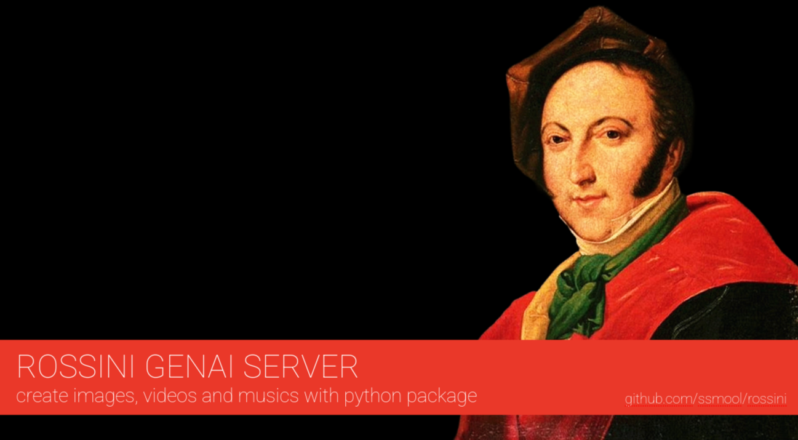

# Rossini GenAI — Multimodal AI Framework

> **Next-Generation Audio-Visual AI Orchestrator Powered by RADCAM, RADGRAM & Local LLMs**

Rossini GenAI is an enterprise-grade multimodal orchestration framework designed for generative media production. It bridges local Large Language Models (via Ollama) with state-of-the-art vision compositing (**RADCAM**), audio & music synthesis engines (**RADGRAM**), and dynamic Retrieval-Augmented Generation (**RAG**).

Whether you are composing AI-generated music tracks synchronized to video beats, rendering static posters with the Grand Theatre Engine, compiling automated web scrapers that generate media on-the-fly, or deploying a production-ready AI server API, Rossini GenAI delivers a unified, memory-efficient Python pipeline.

Created by **#asytric** (`eusmool@gmail.com`).

---

## Technical Features & Core Capabilities

* **Multimodal Generation**: Native support for Text-to-Video, Text-to-Image (Grand Theatre), Animated GIFs, and Beat-Reactive Music/Audio Synthesis.
* **RADGRAM Music Engine**: Algorithmic and neural audio composition supporting stem generation, MIDI-to-audio mapping, and ambient/synthwave soundtrack creation.
* **Local LLM Orchestration**: Direct inference through Ollama with automatic JSON output validation using Pydantic schema guardrails.
* **Web Scraping & Selenium Robotics**: Ready-to-use examples for automating data extraction and transforming scraped assets into AI-generated media pipelines.
* **FastAPI Microservice Ready**: Expose your GenAI pipeline as a REST API endpoint for integration with modern AI Agents, MCP (Model Context Protocol), and backend servers.
* **VRAM Memory Optimization**: Intelligent model ejector (`MemoryManager`) that unloads Ollama LLMs from VRAM before spawning heavy CUDA rendering tasks.

---

## Directory Architecture

This structure matches the native `rossini` package layout:

```text
rossini/
├── config/              # Environment setup and default pipeline parameters
├── core/
│   ├── __init__.py
│   ├── orchestrator.py  # Ollama LLM integration & prompt parsing
│   ├── pipeline.py      # Master execution pipeline
│   ├── schemas.py       # Pydantic JSON guardrails
│   ├── timeline.py      # A/V sync, BPM, and reactivity engine
│   ├── memory.py        # VRAM unload and resource manager
│   ├── image_engine.py  # Grand Theatre image/GIF generation engine
│   └── audio_engine.py  # RADGRAM music & audio synthesis engine
├── models/              # Custom Modelfiles and quantized GGUF weights
├── rag/
│   ├── __init__.py
│   ├── normalizer.py    # Frame and resolution standardization
│   ├── cache.py         # MD5 hash-based asset caching
│   ├── vector_store.py  # Local vector database engine
│   └── online_search.py # Web search engine for video loops
├── __init__.py          # Package entrypoint
├── cli.py               # Command Line Interface
└── README.md            # Documentation

```

---

## Prerequisites & Installation

### System Requirements

* **OS**: Windows / Linux / macOS
* **Python**: 3.10+
* **CUDA**: 11.8 / 12.1+ (For GPU acceleration)
* **FFmpeg**: System binary installed and added to `PATH`
* **Ollama**: Running locally on `http://localhost:11434`

### Installation

```bash
# Clone repository
git clone [https://github.com/asytric/rossini-genai.git](https://github.com/asytric/rossini-genai.git)
cd rossini

# Create virtual environment
python -m venv venv
source venv/bin/activate  # On Windows: venv\Scripts\activate

# Install dependencies
pip install -r requirements.txt

```

---

## Quickstart CLI Commands (Images, Videos, GIFs & Music)

### 1. Generating Music & Soundtracks (RADGRAM Engine)

Synthesize original instrumental music tracks, cyberpunk synthwave beats, or ambient audio using descriptive prompts:

```bash
python -m rossini.cli \
    --type music \
    --prompt "Fast cyberpunk synthwave beat with heavy bass and 120 BPM" \
    --output "outputs/synthwave_track.wav"

```

### 2. Generating Static Images (Grand Theatre Engine)

Create posters, wallpapers, or banners using specialized layout modes and background presets:

```bash
python -m rossini.cli \
    --type image \
    --prompt "Futuristic cyberpunk street view with neon lights" \
    --mode wallpaper \
    --bg wine \
    --pos right \
    --format png \
    --output "outputs/cyber_wallpaper.png"

```

### 3. Generating Animated GIFs

Convert a dynamic text prompt into a short animated sequence:

```bash
python -m rossini.cli \
    --type gif \
    --prompt "Retro 80s synthwave sunset grid driving forward" \
    --output "outputs/synthwave.gif"

```

### 4. Generating Videos (Text-to-Video with Audio Sync)

Run standard video synthesis combining visual prompts and automated soundtracks:

```bash
python -m rossini.cli \
    --type video \
    --prompt "Epic cinematic drone shot over a mountain range with heavy orchestral music" \
    --unload-vram \
    --output "outputs/mountain_epic.mp4"

```

---

## Automation Examples: Selenium & Web Scraping

You can integrate Rossini into web scraping bots or Selenium automation scripts to automatically capture content, trending text, or images from the web and transform them into AI media assets (including soundtracks and posters).

### Example: Selenium Scraper + Rossini Multimodal Generator

```python
import time
from selenium import webdriver
from selenium.webdriver.common.by import By
from rossini.core.image_engine import RossiniImageEngine
from rossini.core.audio_engine import RossiniAudioEngine

def run_scraping_robot():
    print("[*] Starting Selenium Scraper Bot...")
    options = webdriver.ChromeOptions()
    options.add_argument("--headless")
    driver = webdriver.Chrome(options=options)

    try:
        # Exemplo: Acessando tendências globais ou de criatividade
        driver.get("[https://news.ycombinator.com/](https://news.ycombinator.com/)")
        time.sleep(2)
        
        # Extraindo a manchete principal
        first_title = driver.find_element(By.CSS_SELECTOR, ".titleline > a").text
        print(f"[*] Scraped Trending Topic: '{first_title}'")
        
        # 1. Gerando uma imagem temática baseada na notícia
        poster_path = "outputs/scraped_trend_poster.png"
        RossiniImageEngine.generate_image(
            prompt=f"A modern tech poster representing: {first_title}",
            output_path=poster_path,
            mode="banner",
            bg_name="golden",
            export_format="png"
        )

        # 2. Gerando uma trilha sonora instrumental via RADGRAM
        audio_path = "outputs/scraped_soundtrack.wav"
        RossiniAudioEngine.generate_music(
            prompt=f"Ambient electronic music inspired by {first_title}",
            output_path=audio_path,
            bpm=110
        )
        
        print(f"[SUCCESS] Assets successfully generated: \n - Poster: {poster_path}\n - Audio: {audio_path}")

    finally:
        driver.quit()

if __name__ == "__main__":
    run_scraping_robot()

```

---

## Python API Usage

### Programmatic Control of Video and Music Pipelines

```python
from rossini.core.pipeline import RossiniPipeline
from rossini.core.audio_engine import RossiniAudioEngine
from rossini.core.memory import MemoryManager

# 1. Gerar música via RADGRAM diretamente pelo Python
audio_output = RossiniAudioEngine.generate_music(
    prompt="Cinematic dark ambient orchestral track for sci-fi film",
    output_path="outputs/soundtrack.wav",
    bpm=90
)

# 2. Inicializar Pipeline de Vídeo com local Ollama
pipeline = RossiniPipeline(
    model_name="llama3:latest",
    ollama_url="http://localhost:11434"
)

# 3. Executar pipeline combinando prompt e trilha gerada
pipeline.run(
    input_video_path="raw_speaker.mp4",
    user_prompt="Vertical TikTok video with cyberpunk aesthetic and custom soundtrack",
    output_path="outputs/final_short.mp4"
)

# Liberar VRAM após geração
MemoryManager.unload_ollama_model(model_name="llama3:latest")

```

---

## REST API Integration (FastAPI Endpoint for AI Servers & Agents)

Deploy Rossini GenAI as a microservice endpoint. This setup is ideal for consumption by modern AI agents, automated backend workflows, or MCP (Model Context Protocol) servers.

Run the API server using Uvicorn:

```bash
uvicorn rossini.api:app --host 0.0.0.0 --port 8000 --reload

```

### `rossini/api.py` Implementation Example:

```python
from fastapi import FastAPI, BackgroundTasks
from pydantic import BaseModel
from rossini.core.pipeline import RossiniPipeline
from rossini.core.image_engine import RossiniImageEngine
from rossini.core.audio_engine import RossiniAudioEngine

app = FastAPI(
    title="Rossini GenAI API Engine", 
    version="2.1.0",
    description="Multimodal GenAI server for video, image, music and agent orchestration."
)

class GenerationRequest(BaseModel):
    media_type: str = "video"  # "video", "image", "gif", "music"
    prompt: str
    input_video_path: str = ""
    output_path: str = "outputs/api_output.mp4"
    model_name: str = "llama3:latest"
    mode: str = "wallpaper"
    bg_name: str = "wine"
    format: str = "png"
    bpm: int = 120

def process_media_task(request: GenerationRequest):
    if request.media_type == "image":
        RossiniImageEngine.generate_image(
            prompt=request.prompt,
            output_path=request.output_path,
            mode=request.mode,
            bg_name=request.bg_name,
            export_format=request.format
        )
    elif request.media_type == "music":
        RossiniAudioEngine.generate_music(
            prompt=request.prompt,
            output_path=request.output_path,
            bpm=request.bpm
        )
    else:
        pipeline = RossiniPipeline(model_name=request.model_name)
        pipeline.run(
            input_video_path=request.input_video_path,
            user_prompt=request.prompt,
            output_path=request.output_path
        )

@app.post("/api/v1/generate")
async def generate_media(request: GenerationRequest, background_tasks: BackgroundTasks):
    background_tasks.add_task(process_media_task, request)
    return {
        "status": "processing",
        "media_type": request.media_type,
        "message": "Multimodal generation task queued successfully.",
        "target_output": request.output_path
    }

```

---

## License & Support

* **Maintainer**: **#asytric**
* **Contact**: `eusmool@gmail.com`
* **License**: MIT License
